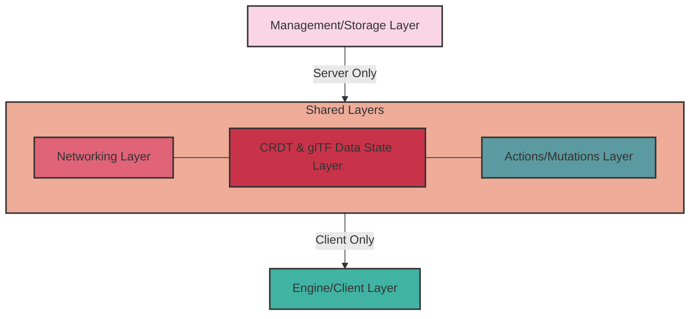

# Vircadia World

This project must be small (fewer lines of code, though no code golf). The scale MUST be balanced: more complexity = less lines of code to allow for that, OR if you want more lines of code, it must be less complex by an order of magnitude, but even then the lines of code must be minimal.

Stack:

1. Node.js (runtime)
1. tRPC with Express (router)

## Install

To get started, clone the repository and install the dependencies:

```sh
npm install
```

## Develop

To run all apps and packages in development mode, run the following command:

```sh
npm run dev
```

## Architecture


### 1. Overview
This document outlines the design for a flexible, scalable, and secure game framework that supports peer-to-peer interactions with central server validation. The framework is built on a foundation of Conflict-free Replicated Data Types (CRDTs) to manage distributed state and uses glTF files for world representation.

### 2. Architecture
The framework is structured in layers, with components shared between client and server:

Server-only Layer:
- Management and Storage Layer

Shared Layers (Client and Server):
- Networking Layer
- CRDT and glTF Data State Layer
- Actions/Mutations Layer

Client-only Layer:
- Engine/Client Layer (External)



#### 2.1 Management and Storage Layer (Server-only)
Handles server-side management of connections, permissions, and data storage.

#### 2.2 Networking Layer (Shared)
Manages communication between clients and the server, including peer-to-peer connections.

#### 2.3 CRDT and glTF Data State Layer (Shared)
Maintains the distributed state using CRDTs and glTF data, ensuring consistency across clients and server.

#### 2.4 Actions/Mutations Layer (Shared)
Defines and validates state changes through actions, ensuring data integrity and preventing unauthorized modifications.

#### 2.5 Engine/Client Layer (External, Client-only)
Responsible for interpreting and rendering the game state, including:
- Rendering and graphics
- User interface
- Camera and controls
- Client-specific game logic

### 3. Key Components
#### 3.1 Store
The central component for state management and mutations.

#### 3.2 World Representation
The game world is represented using glTF files, which are managed and segmented for efficient loading and rendering.

#### 3.3 Server-side Culling
Implements visibility checks on the server to prevent cheating.

### 4. Key Features
#### 4.1 Peer-to-Peer with Central Validation
- Clients connect peer-to-peer and to a central server
- All changes are validated by the central server

#### 4.2 Action-based State Changes
- State changes are defined as "actions" with associated rules
- Actions are validated against rulesets before application

#### 4.3 CRDT-based State Management
- Ensures eventual consistency across all peers
- Handles concurrent edits without central coordination

#### 4.4 Interest Management
- Implemented in the Management Layer
- Determines which game objects each client needs to know about

#### 4.5 Permissions System
- Controls access to different parts of the game world
- Integrated with the interest management system

#### 4.6 Shared Action Validation
- Action scripts are present on both client and server SDKs
- Allows clients to validate data locally before sending to the server
- Server performs final validation to ensure data integrity

#### 4.7 Interpolation in Action Scripts
- Interpolation logic is implemented within individual action scripts
- Actions like "move" or "apply force" include their own interpolation methods
- Allows for action-specific smoothing and prediction

### 5. Optimizations
#### 5.1 Delta CRDTs
Use delta-based CRDTs to reduce bandwidth usage by only sending changes.

#### 5.2 Batching
Group multiple CRDT operations into a single network message to reduce overhead.

#### 5.3 Compression
Apply compression techniques to CRDT messages to further reduce bandwidth usage.

#### 5.4 Adaptive Update Rates
Adjust update frequency based on network conditions and game requirements.

### 6. Security Measures
#### 6.1 Server-side Validation
All critical game logic and state changes are validated on the server.

#### 6.2 Cryptographic Signing
Actions are cryptographically signed to prevent tampering.

#### 6.3 Periodic Full State Validation
The server periodically validates the full game state to detect any inconsistencies.

### 7. Challenges and Solutions
#### 7.1 Latency
- Challenge: P2P connections can introduce variable latency.
- Solution: Implement client-side prediction and server reconciliation.

#### 7.2 Scalability
- Challenge: Increased network traffic and processing load with many peers.
- Solution: Use interest management and spatial partitioning to limit update scope.

#### 7.3 Synchronization Complexity
- Challenge: Ensuring consistent world state across all peers.
- Solution: Use CRDTs for eventual consistency, with server as final arbiter.

#### 7.4 Cheating Prevention
- Challenge: Malicious clients modifying local code or state.
- Solution: Server-side validation, obfuscation, and cryptographic signing of actions.

#### 7.5 Balancing Client-side Prediction and Server Authority
- Challenge: Maintaining responsive gameplay while ensuring server-authoritative state
- Solution: Implement client-side prediction in action scripts, with server reconciliation

### 8. Future Considerations
- Develop a standardized format for action scripts, including interpolation logic
- Create tools for easy creation and testing of custom actions
- Investigate advanced CRDT techniques for improved conflict resolution
- Explore optimizations for large-scale world simulations with many concurrent actions
- Research machine learning approaches for dynamic action interpolation and prediction

### 9. Conclusion

This framework provides a flexible and secure foundation for building multiplayer games with distributed state management. By sharing critical components like networking, CRDT-based state management, and action validation between client and server, it ensures consistency and security while allowing for responsive gameplay. The clear separation of the engine/client layer allows for diverse implementations while maintaining a standardized core. This architecture offers a scalable and performant solution for networked games, with built-in mechanisms for smooth interpolation and client-side prediction through action-specific logic.
