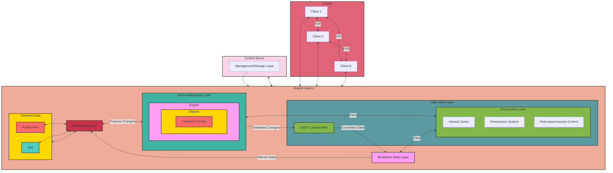

# Vircadia World

This project must be small (fewer lines of code, though no code golf). The scale MUST be balanced: more complexity = less lines of code to allow for that, OR if you want more lines of code, it must be less complex by an order of magnitude, but even then the lines of code must be minimal.

Stack:

1. Node.js (runtime) (req Node.js >= 22)
1. tRPC with Express (router)

## Install

To get started, clone the repository and install the dependencies:

```sh
npm install
```

## Develop

To run all apps and packages in development mode, run the following command:

```sh
npm run dev
```

## Architecture




### 1. Management/Storage Layer (Server-only)
- Handles server-side management of connections, permissions, and data storage.
- Implements periodic full state validation to detect any inconsistencies.

### 2. Networking Layer (Shared)
- Manages communication between clients and the server, including peer-to-peer connections.
- Implements adaptive update rates to adjust frequency based on network conditions and game requirements.

### 3. Data State Layer (Shared)
- CRDT Commit Filter:
  - Ensures eventual consistency across all peers.
  - Uses delta-based CRDTs to reduce bandwidth usage by only sending changes.
- Permissions Layer:
  - Interest Zones: Determines which game objects each client needs to know about.
  - Permissions System: Controls access to different parts of the game world.
  - Role-based Access Control: Implements tiered, numerical role-based permissions for granular control over actions.

### 4. Actions/Mutations Layer (Shared)
- Defines and validates state changes through actions, ensuring data integrity and preventing unauthorized modifications.
- Each action has a unique ID to prevent resubmission to the sender once validated.
- Prefer using physical actions instead of spamming "complete state" to compensate for processing lag and latency lag, allowing the client(s) and server to simulate actions and do costly sync ups at keyframes instead.
- Implements client-side prediction in action scripts, with server reconciliation for responsive gameplay.
- Actions like "move" or "apply force" include their own interpolation methods for smooth transitions.

### 5. Broadcast State Layer (Shared)
- Handles the broadcasting of state to clients or the server.
- Applies permission filtering to ensure clients only receive data they should see.

### 6. Engine/Client Layer (External, Client-only)
- Responsible for interpreting and rendering the game state, including:
  - Rendering and graphics
  - User interface
  - Camera and controls
  - Client-specific game logic

### Key Features and Optimizations

1. Peer-to-Peer with Central Validation:
   - Clients connect peer-to-peer and to a central server.
   - All changes are validated by the central server.

2. CRDT-based State Management:
   - Handles concurrent edits without central coordination.
   - Implements batching to group multiple CRDT operations into a single network message.
   - Applies compression techniques to CRDT messages to further reduce bandwidth usage.

3. Security Measures:
   - Server-side validation for all critical game logic and state changes.
   - Cryptographic signing of actions to prevent tampering.
   - Obfuscation techniques to protect client-side code.

4. World Representation:
   - Uses glTF files for efficient loading and rendering of the game world.
   - Implements server-side culling for visibility checks to prevent cheating.

5. Transient Data Handling:
   - Manages real-time, non-persistent data such as audio/voice and text communication.
   - Implements low-latency protocols for voice chat and instant messaging.
   - Applies spatial audio techniques for immersive voice communication.
   - Integrates with the Permissions Layer to control access to communication channels.

6. Engine and Object Constraint Scripts:
   - The Actions/Mutations Layer includes an Engine component for managing world objects.
   - Objects can have associated Constraint Scripts that define their behavior and limitations.
   - Scripts are executed in a try-catch block, isolating them from the main framework:
     - If a script throws an error, the change is rejected.
     - If a script runs successfully, it validates that the object performed a valid action.
   - Example: A script might check an object's position and rotation, ensuring it's at 180 degrees instead of 270 degrees.
   - This approach allows for flexible object behavior while maintaining system stability and integrity.
   - Constraint Scripts can interact with the Engine to access and modify object properties safely.

### Challenges and Solutions

1. Latency:
   - Challenge: P2P connections can introduce variable latency.
   - Solution: Implement client-side prediction and server reconciliation.

2. Scalability:
   - Challenge: Increased network traffic and processing load with many peers.
   - Solution: Use interest management and spatial partitioning to limit update scope.

3. Cheating Prevention:
   - Challenge: Malicious clients modifying local code or state.
   - Solution: Each client, and the server, validate the state through actions to ensure "impossible" actions are not committed and are instead flagged.

### Future Considerations

- Develop a standardized format for action scripts, including interpolation logic.
- Create tools for easy creation and testing of custom actions.
- Investigate advanced CRDT techniques for improved conflict resolution.
- Explore optimizations for large-scale world simulations with many concurrent actions.
- Research machine learning approaches for dynamic action interpolation and prediction.
